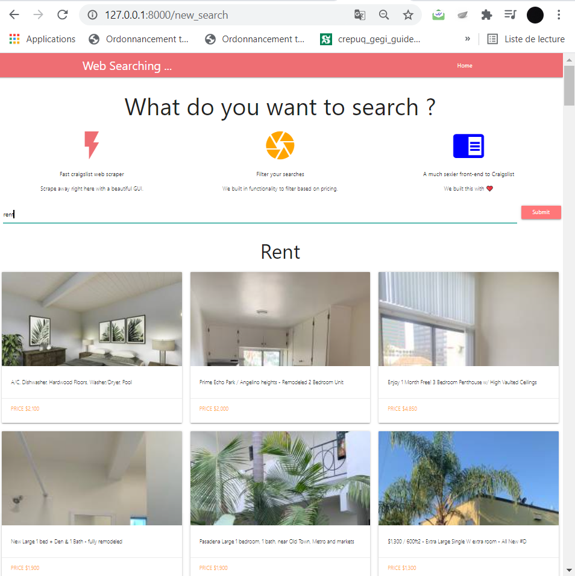

<!-- PROJECT LOGO -->
 

  

  <h3 align="center">Craigslist Web Scraper</h3>

  

    This project will provides the user with :
    <li> A Fast craigslist web scraper with a beautiful GUI. </li>
    <li> A much sexier front-end to Craigslist </li>
    <li> A Fast craigslist web scraper with a beautiful GUI. </li>
  

### Built With

This section should list any major frameworks that you built your project using. Leave any add-ons/plugins for the acknowledgements section. Here are a few examples.
* Python
* Django
* BeautifulSoup
* Html/Css

### Demo

